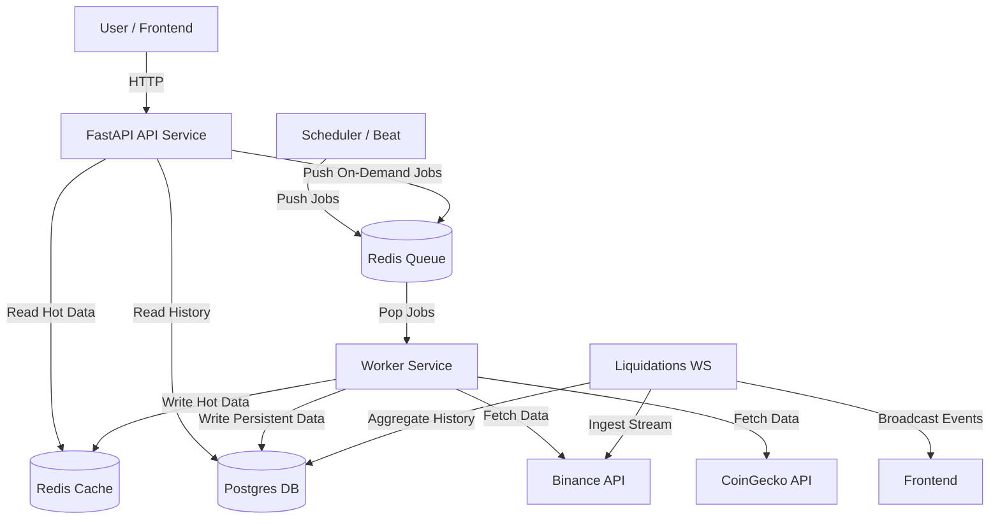

# Architecture

## Overview

Argus is a professional-grade cryptocurrency dashboard designed with a scalable, event-driven architecture.
It uses a **Worker-Queue** pattern to decouple data ingestion from the user-facing API, ensuring low latency and high reliability.

### System Diagram

## Tech Stack

### Core Infrastructure (Dockerized)

- **Docker Compose**: Orchestrates all services (API, Worker, Redis, DB).
- **Redis (Alpine)**:
  - **Purpose**: High-speed cache for "Live Tickers" and "Market Summaries".
  - **Role**: Message Broker for the Task Queue.
- **PostgreSQL (16)**:
  - **Purpose**: Persistent storage for historical OHLCV candles.
  - **Schema**: Optimized time-series indexing `(symbol, provider, timeframe, timestamp)`.

### Backend Components (Python)

- **FastAPI**: Serves data to the frontend. No longer calls external APIs directly.
- **Worker Service**: A dedicated background process using `arq` or `Celery`.
  - **Responsibilities**: Rate-limit handling, data normalization, database writes.
- **Providers**:

  - `BinanceProvider`: For high-frequency trade data.
  - `CoinGeckoProvider`: For rich metadata and rankings.

- **WebSocket Service**:
  - **Purpose**: Real-time ingestion of liquidation events (`liquidation_ws.py`).
  - **Function**: Connects to Binance Futures WS `!forceOrder@arr` stream.
  - **Aggregation**: Buckets events by time (15s) and price (e.g. $50) into **Redis** for efficient heatmap rendering.

### Frontend

- **Next.js 14**: Server-side rendering and static generation.
- **Tailwind CSS**: Utility-first styling with **Shadcn UI** components.
- **React Query**: Efficient server-state management (polling endpoints).
- **Zustand**: Client-side state (Theme, Indicators).
- **Visualization**:
  - `lightweight-charts`: Candlestick data.
  - `chart.js`: Analytics bars/lines.
  - Custom Canvas: High-performance Heatmap rendering.

## Data Flow

1.  **Ingestion**:
    - **Scheduled**: "Top 100 Coins" metadata fetched every 60s. Live prices cached every 5s.
    - **On-Demand**: When a user views a chart, the API triggers a "Backfill" job if data is missing.
2.  **Storage**:
    - Hot data (Price, % Change) lives in **Redis** for <5ms access.
    - Cold data (Historical 1h/1d candles) lives in **Postgres**.
3.  **Serving**:
    - The API simply queries Redis or Postgres. It never blocks on external API calls.

## Testing Strategy

- **E2E (Playwright)**: Verifies that the Frontend correctly displays data fed by the Worker.
- **Unit Tests**: Verify that Providers correctly parse external API responses.

---

## Detailed Documentation

For more detailed architecture documentation including sequence diagrams and modern standards compliance review, see:

- **[Data Architecture](./DATA_ARCHITECTURE.md)** - Complete data flow diagrams, storage strategy, and implementation patterns
