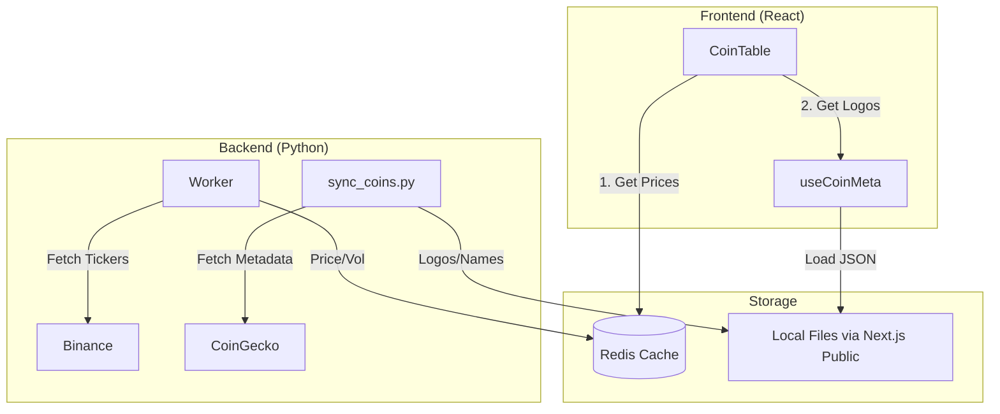

# Coin Metadata Synchronization & Hybrid Architecture

## Overview

Argus uses a **Hybrid Data Architecture** to provide professional-grade market data without sacrificing performance or hitting strict API rate limits.

| Source        | Role                                          | Update Freq  | Why?                                                                          |
| ------------- | --------------------------------------------- | ------------ | ----------------------------------------------------------------------------- |
| **Binance**   | Real-time Market Data (Price, Volume, Change) | High (30s)   | Best liquidity, reliable WebSocket/API, no strict rate limits on market data. |
| **CoinGecko** | Rich Metadata (Logos, Full Names)             | Low (3 Days) | Best metadata source, high-quality images, but strict API rate limits.        |

---

## The Hybrid Workflow



## Live Snapshot Worker (New)

While `sync_coins.py` handles static assets (images), the dynamic metadata is handled by the **Backend Worker**.

### Job: `sync_market_snapshot`

- **Schedule**: Every 5 minutes.
- **Source**: CoinGecko API (`/coins/markets`).
- **Data**: Fetches Top 500 coins including:
  - **7-Day Sparklines** (Array of 168 prices)
  - **Market Cap & Volume**
  - **Logos** (URL fallback)
- **Role**: Provides the "Base State" for the market. Live Binance prices are overlaid on top of this snapshot.

---

## CoinGecko Sync Script (Static)

The synchronization is handled by `scripts/sync_coins.py`.

### What it does:

1. **Fetches Top 250 Coins**: Queries CoinGecko for the top coins by market cap.
2. **Downloads Logos**: Saves high-res PNGs to `frontend/public/data/coins/images/`.
3. **Generates Metadata**: Creates a optimized `coins.json` map in `frontend/public/data/coins/`.

### Optimized JSON Structure

We intentionally strip dynamic data (price, market cap) from the static JSON to prevent stale data.

```json
[
  {
    "id": "bitcoin",
    "symbol": "BTC",
    "name": "Bitcoin",
    "image": "/data/coins/images/btc.png"
  }
]
```

## Frontend Integration

### `useCoinMeta` Hook

A dedicated React hook matches real-time Binance data with cached CoinGecko metadata.

1. **Loads `coins.json`** on mount.
2. **Creates a Map** for O(1) lookup by symbol (e.g., `BTC` -> `Bitcoin`).
3. **Graceful Fallback**: If a coin isn't in the cache (e.g., a new listing), it falls back to the symbol and a generated colored avatar.

```typescript
// Example Usage
const { coinMeta } = useCoinMeta();
const name = getCoinName("BTC", coinMeta); // "Bitcoin"
const logo = getCoinImageUrl("BTC", coinMeta); // "/data/coins/images/btc.png"
```

## How to Run

### Manual Sync

```bash
cd backend
./venv/bin/python3 scripts/sync_coins.py --limit 250
```

### Automation

Add to crontab to run every 3 days (metadata changes rarely):

```bash
0 2 */3 * * cd /path/to/project && backend/venv/bin/python3 scripts/sync_coins.py
```
