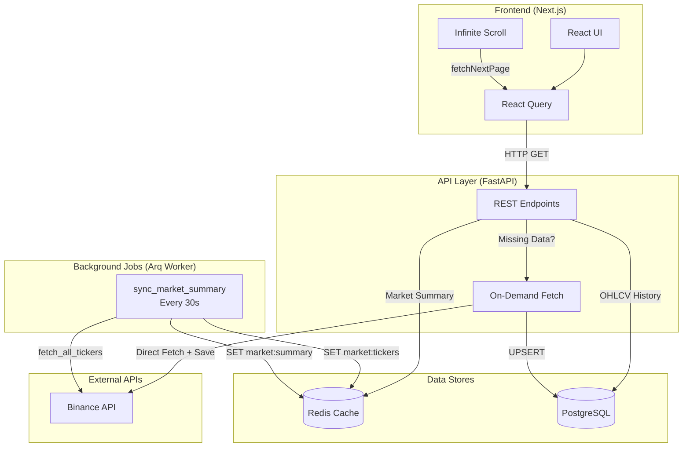
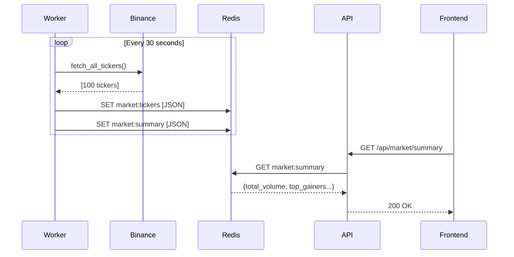
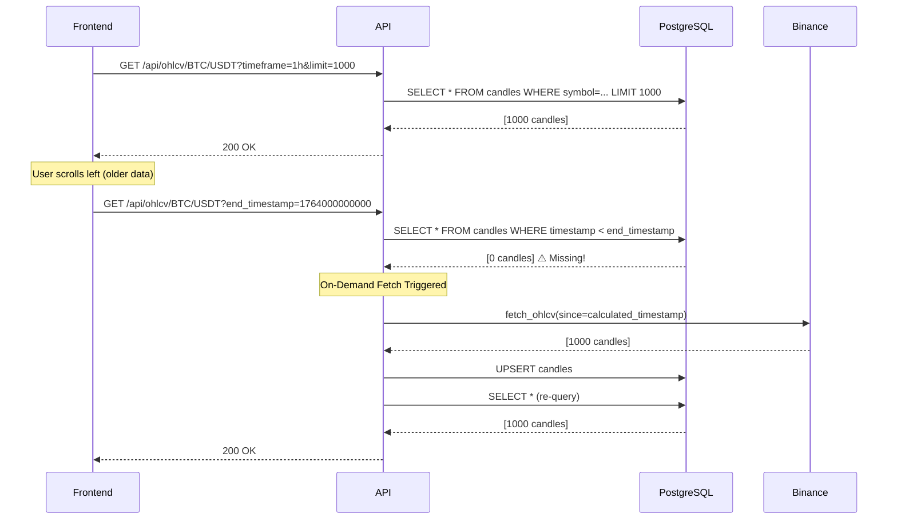
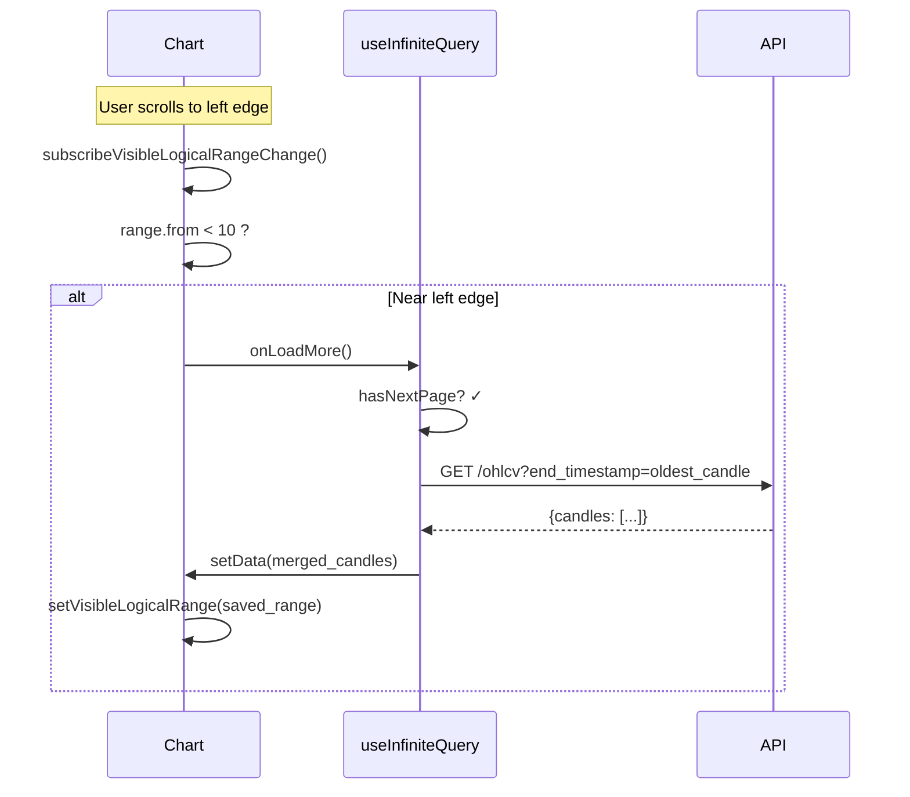

# Argus Data Architecture

## Overview

This document details the data flow architecture for Argus, focusing on how market data is fetched, stored, and served to users. The design follows modern event-driven patterns for scalability and reliability.

---

## Architecture Diagram



---

## Data Flow Patterns

### 1. Real-Time Ticker Data (Hot Path)

**Pattern**: Worker → Redis → API → Frontend
**Latency**: < 50ms



**Why This Approach?**

- ✅ **Low latency**: Redis provides sub-millisecond reads
- ✅ **No rate limits**: Frontend never hits external APIs
- ✅ **Cached for all users**: Single source of truth

---

### 2. Historical OHLCV Data (Cold Path)

**Pattern**: Frontend → API → PostgreSQL (+ On-Demand Binance Fetch)
**Latency**: < 100ms (cached) / < 2s (fetching new data)



**Why This Approach?**

- ✅ **Lazy loading**: Only fetch data when user needs it
- ✅ **Persistent storage**: Historical data never re-fetched
- ✅ **Pagination support**: `end_timestamp` enables infinite scroll

---

### 3. Infinite Scroll Implementation

**Pattern**: Frontend State → Visible Range Detection → API Pagination



**Key Implementation Details:**

- `useInfiniteQuery` manages pagination state
- `getNextPageParam` returns oldest candle's timestamp
- **Closure fix**: `onLoadMoreRef` prevents stale state

---

## Storage Strategy

### Redis (Hot Data)

| Key               | TTL                   | Contents                         |
| ----------------- | --------------------- | -------------------------------- |
| `market:tickers`  | ∞ (updated every 30s) | All coin prices + 24h changes    |
| `market:summary`  | ∞ (updated every 30s) | Total volume, top gainers/losers |
| `ticker:{symbol}` | Optional              | Individual ticker price          |

### PostgreSQL (Cold Data)

| Table     | Primary Key                                | Indexed Columns                    |
| --------- | ------------------------------------------ | ---------------------------------- |
| `candles` | `(symbol, provider, timeframe, timestamp)` | `symbol`, `timeframe`, `timestamp` |

**Upsert Strategy**: `session.merge()` ensures no duplicates

---

## Modern Standards Compliance

### ✅ Patterns We Follow

| Pattern                             | Implementation                               |
| ----------------------------------- | -------------------------------------------- |
| **CQRS** (Command Query Separation) | Worker writes, API reads                     |
| **Event-Driven Architecture**       | Jobs triggered by scheduler/API              |
| **Cache-Aside Pattern**             | API reads cache first, fetches on miss       |
| **Lazy Loading**                    | Data fetched only when user scrolls          |
| **Optimistic UI**                   | Chart preserves scroll position during loads |

### ✅ Best Practices

1. **Decoupled Ingestion**: Worker is separate from API
2. **Rate Limit Handling**: Worker respects Binance limits
3. **Idempotent Operations**: Upsert prevents duplicates
4. **Graceful Degradation**: API returns cached data if Binance fails
5. **Pagination**: Timestamp-based cursor pagination

### ⚠️ Potential Improvements

| Area                   | Current           | Recommended                         |
| ---------------------- | ----------------- | ----------------------------------- |
| **WebSocket**          | Polling every 60s | Real-time push for tickers          |
| **Data Compression**   | None              | gzip for large OHLCV responses      |
| **Cache Invalidation** | TTL-based         | Pub/Sub for instant updates         |
| **Horizontal Scaling** | Single worker     | Multiple workers with Redis locking |

---

## File Structure

```
backend/
├── app/
│   ├── main.py              # FastAPI app
│   ├── routes/
│   │   └── market.py        # API endpoints
│   ├── providers/
│   │   └── binance_provider.py
│   ├── schemas/
│   │   └── candle.py        # SQLModel
│   ├── storage.py           # Redis/DB managers
│   └── worker.py            # Arq worker
└── scripts/
    └── backfill_history.py  # Bulk data migration
```

---

## Conclusion

The Argus data architecture follows modern best practices:

- **Separation of concerns** between ingestion and serving
- **Hybrid storage** (Redis for speed, Postgres for persistence)
- **On-demand fetching** to minimize upfront data load
- **Infinite scroll** with proper state management

The system is designed to scale horizontally and can be extended with WebSocket support for real-time updates.
