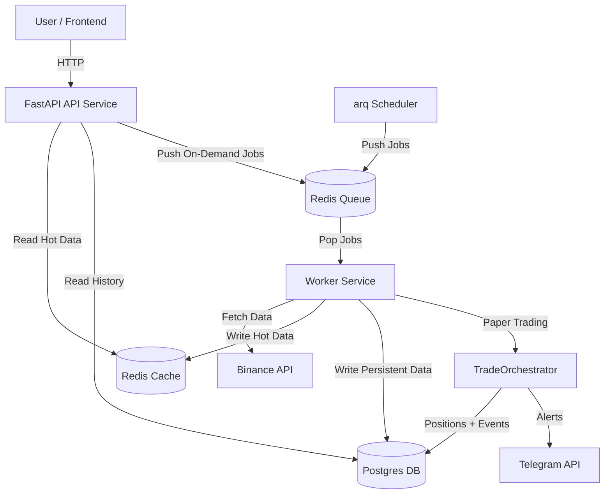

# Architecture

## Overview

Argus is a professional-grade cryptocurrency dashboard designed with a scalable, event-driven architecture.
It uses a **Worker-Queue** pattern to decouple data ingestion from the user-facing API, ensuring low latency and high reliability. As of v0.9.0 (March 2026), the system also includes a paper trading engine that simulates Titan signals (regime-filtered) against real market prices. Oracle is deprecated from UI but backend code is preserved.

### System Diagram



## Tech Stack

### Core Infrastructure (Dockerized)

- **Docker Compose**: Orchestrates all services (API, Worker, Redis, DB).
- **Redis (Alpine)**:
  - **Purpose**: High-speed cache for "Live Tickers" and "Market Summaries".
  - **Role**: Message Broker for the Task Queue.
- **PostgreSQL (16)**:
  - **Purpose**: Persistent storage for historical OHLCV candles.
  - **Schema**: Optimized time-series indexing `(symbol, provider, timeframe, timestamp)`.

### Backend Components (Python)

- **FastAPI**: Serves data to the frontend. No longer calls external APIs directly.
- **Worker Service**: A dedicated background process using **arq** (Redis-based job queue).
  - **Responsibilities**: Rate-limit handling, data normalization, database writes, signal scanning, paper trade execution.
- **Providers**:
  - `BinanceProvider`: For high-frequency trade data (CCXT wrapper).

### Frontend

- **Next.js 14**: Server-side rendering and static generation.
- **Tailwind CSS**: Utility-first styling with **Shadcn UI** components.
- **React Query**: Efficient server-state management (polling endpoints).
- **Zustand**: Client-side state (Theme, Indicators).
- **Visualization**:
  - `lightweight-charts`: Candlestick data.
  - `chart.js`: Analytics bars/lines.
  - Custom Canvas: High-performance Heatmap rendering.

## Data Flow

1.  **Ingestion**:
    - **Scheduled (arq)**: See worker schedule table below for full job list and timing.
    - **On-Demand**: When a user views a chart, the API triggers a "Backfill" job if data is missing.
2.  **Storage**:
    - Hot data (Price, % Change, trading config) lives in **Redis** for <5ms access.
    - Cold data (Historical 1h/1d candles, signal log, positions, trade events, optimization experiments) lives in **Postgres**.
3.  **Serving**:
    - The API simply queries Redis or Postgres. It never blocks on external API calls.

## Backend Module Reference

### `backend/app/routes/`

| File | Router prefix | Purpose |
|------|--------------|---------|
| `market.py` | `/api/market` | Tickers, OHLCV candles, market summary |
| `indicators.py` | `/api/indicators` | Technical indicator endpoints |
| `strategy.py` | `/api/strategy` | Titan signal + regime detection endpoints (Oracle deprecated from UI) |
| `analytics.py` | `/api/analytics` | Screener, signal log, best setups; `GET /signal-log/config` + `PUT /signal-log/config` for live config management; `GET /signal-outcomes/trend` for daily win-rate time-series |
| `trading.py` | `/api/trading` | Paper trading — positions, trade events, portfolio, config |
| `optimization.py` | `/api/optimization`, `/api/trading/analysis` | Experiment log, best config, apply; live vs backtest recommendations |

### `backend/app/jobs/` + Worker Schedule

All background jobs are registered with the arq worker (`backend/app/worker.py`). Full schedule:

| Job | Schedule | Description |
|-----|----------|-------------|
| `sync_market_summary` | Every 60s | Fetch all USDT tickers from Binance, cache top 250 by volume in Redis. Also updates worker heartbeat. |
| `sync_market_snapshot` | Every 5min | Fetch top 250 coins from CoinGecko (mcap, sparklines, 1h/7d change). Cached 10min TTL. |
| `sync_analytics_cache` | Every 5min (offset +2min) | Pre-warm `best-setups` cache so dashboard loads instantly. |
| `log_watchlist_setups` | 4H candle closes +3min (00:03, 04:03, …, 20:03 UTC) | Run Titan on watchlist (BTC/ETH/BNB), filter by regime (BULL→LONG, BEAR→SHORT), log to `signal_log` table with `source='live'`. Deduplicates via partial unique index. |
| `log_best_setups` | Every 5min (+3min offset) | Read cached best-setups (top 100 by volume), persist qualifying signals (conviction >= 50) as `source='scanner'`. Cheap Redis read + batch insert. |
| `log_contrarian_signals` | Every 10min | Scan top 50 symbols for overextensions (3x ATR from EMA200), log to `signal_log` with `source='counter'`. |
| `resolve_signal_outcomes` | Every 5min | Resolves OPEN signals via **Fast-path** (live tickers) every 5m + **Historical** (candle walk) every 30m. |
| `execute_signals` | Every 10min | Pick up unprocessed OPEN signals (live + scanner) and create PENDING paper trade positions via TradeOrchestrator. |
| `manage_positions` | Every 5min | Check pending fills (price reached entry?), check TP/SL hits via candle walk, run circuit breaker. |
| `sync_trading_balance` | Every 10min | Cache portfolio balance in Redis for quick API access. |
| `snapshot_signal_outcomes` | Daily at 00:05 UTC | Aggregate all resolved `signal_log` rows into `signal_outcome_snapshot` daily rows, sliced by (regime, conviction_band, source, coin) with "ALL" rollup variants. Accepts optional `snapshot_date` for backfill; idempotent via grand-total sentinel row. |

**On startup**, the worker also runs: initial signal scan, position recovery, missed candle close recovery (regime-based), signal execution, and snapshot backfill (checks last 7 days; calls `snapshot_signal_outcomes` for each missing date; non-fatal).

**Direction filtering**: Regime-based (BTC weekly EMA50). BEAR regime → SHORT signals only, BULL → LONG only, UNKNOWN → all. Configured via Redis key `signal_log:config` (readable/writable via `GET /api/analytics/signal-log/config` and `PUT /api/analytics/signal-log/config`; changes take effect on the next worker cycle without restart).

**4H screener keys**: The 4H candle-close scanner (`log_watchlist_setups`) reads Titan screener results from `analytics:screener:4h:{symbol}` Redis keys.

---

### Signal Sources — What Each One Means

There are three `source` values in the `signal_log` table. They serve different purposes and have different scopes:

| Source | Job | Universe | Schedule | Traded? |
|--------|-----|----------|----------|---------|
| `live` | `log_watchlist_setups` | **Watchlist only** (BTC/ETH/BNB + configured coins) | 4H candle closes — 6x/day | ✅ Yes |
| `scanner` | `log_best_setups` | **Top 100 by volume** (all logged, watchlist filtered for trading) | Every 5 min | ✅ Watchlist coins only |
| `counter` | `log_contrarian_signals` | Top 50 by volume | Every 10 min | ❌ No — observation only |

**`live` (Signal Log → Live tab)**
- Runs Titan strategy directly on each watchlist coin at every 4H candle close.
- Most deliberate signal type — based on completed candle data, not a cache snapshot.
- Regime-filtered: BULL→LONG only, BEAR→SHORT only, UNKNOWN→all.
- Conviction threshold: configurable (default 55).

**`scanner` (Signal Log → Scanner tab)**
- Reads the `best-setups` Redis cache (pre-warmed every 5 min by `sync_analytics_cache`).
- Logs signals from all top-100 coins for scouting — even non-watchlist coins appear in Signal Log.
- **Trading gate**: `execute_signals` filters to watchlist-only before passing to the orchestrator. Non-watchlist scanner signals are tracked for outcome learning but never traded.
- Conviction threshold: configurable (default 50).

**Paper Trading**
- `execute_signals` (every 10 min) picks up OPEN signals from `live` + `scanner` sources with no existing position.
- Watchlist filter applied — only watchlist coins are sent to `TradeOrchestrator`.
- Risk gates in sequence: drawdown circuit breaker → max concurrent positions → correlated-pair limit → conviction gate → position sizing.
- Positions follow: `PENDING → OPEN → CLOSED / EXPIRED / CANCELLED`.
- Current config: 7% risk per trade, 2x leverage, 200% max exposure, 12% drawdown stop, 16h expiry.

**Key distinction**: Scanner logs broadly (scouting), live trades precisely (watchlist only). Paper trading is the execution layer on top of both — it only acts on watchlist-approved signals regardless of source.

---

### `backend/app/trading/`

Paper trading engine. All components are async and interact with the Postgres `Position` + `TradeEvent` tables and the Redis trading config key (`trading:config`).

| File | Class / entrypoint | Description |
|------|--------------------|-------------|
| `orchestrator.py` | `TradeOrchestrator` | Main simulation loop. `process_signal()` creates positions from new OPEN signals (accepts optional `batch_positions` list to prevent race conditions in same-cycle signal processing), filling immediately at market price (intended entry preserved for reference). `check_pending_fills()` market-fills any remaining PENDING positions. `check_open_positions()` transitions OPEN → CLOSED on TP/SL hit or expiry; `check_circuit_breaker()` pauses trading when drawdown threshold is exceeded. Default config stored in `DEFAULT_TRADING_CONFIG` and persisted to Redis. Key config params: `max_position_size_pct` (3% risk per trade), `max_leverage` (2.0), `max_total_exposure_pct` (200%), `max_drawdown_pct` (12%), `order_expiry_hours` (16), `min_conviction` (50). |
| `risk_manager.py` | `RiskManager` | Static gate methods run in sequence before any position is created: drawdown circuit breaker, max concurrent positions, correlated-pair limit (`correlation_groups` config), conviction gate (`min_conviction`). Position size = `balance × max_position_size_pct` (notional cap). First failure rejects the trade. |
| `portfolio.py` | `PortfolioTracker` | Real-time P&L, balance, and drawdown derived from the `Position` table + current prices pulled from Redis market tickers. Helper `_price_map_from_tickers()` converts the `market:tickers` Redis list into a `{BTCUSDT: price}` dict. |
| `analyzer.py` | `TradeAnalyzer` | Queries closed positions and `OptimizationExperiment` rows. Surfaces per-coin, per-direction, per-market-state, and per-conviction-bucket breakdowns. Compares live win rate vs backtest win rate and generates config change recommendations. |
| `backtest_engine.py` | `BacktestConfig`, `backtest_symbol()`, `compute_stats()` | Reusable backtest core extracted from `run_signal_backtest.py`. `BacktestConfig` is a dataclass covering all knobs (SL/TP multipliers, gate flags, conviction threshold). Used by `optimize_trading.py` and the optimization API. |
| `notifier.py` | `notify_*` functions | Optional Telegram alerts for key trade events. Reads `TELEGRAM_BOT_TOKEN` and `TELEGRAM_CHAT_ID` env vars; all calls are no-ops if either is unset. |

#### Position lifecycle

```
PENDING  →  OPEN  →  CLOSED
                  ↘  EXPIRED   (order_expiry_hours elapsed, never filled)
                  ↘  CANCELLED (circuit breaker or risk rejection after creation)
```

### `backend/app/schemas/`

| File | SQLModel table(s) | Key constraints |
|------|-------------------|----------------|
| `signal_log.py` | `SignalLog` | Partial unique index `uq_signal_log_open` on `(symbol, direction) WHERE outcome='OPEN'` — enforces one active signal per pair+direction. Phase 18 columns: `regime_at_resolution`, `btc_price_at_resolution`, `time_to_resolution_ms`. Phase 19 columns: `regime_at_signal` (BTC regime when the signal fires), `btc_price_at_signal` (BTC spot price at signal fire time). |
| `trading.py` | `Position`, `TradeEvent` | `Position`: partial unique index `uq_position_active` on `(symbol, direction) WHERE status IN ('PENDING','OPEN')`. `TradeEvent.event_type` values: `CREATED`, `FILLED`, `TP_HIT`, `SL_HIT`, `CANCELLED`, `CIRCUIT_BREAKER`, `RISK_REJECTED` |
| `optimization.py` | `OptimizationExperiment` | 23-field table — params tested (`sl_mult`, `tp_mult`, `tp_adaptive`, `min_titan_confidence`, gate flags, `min_conviction`) + result metrics (`win_rate`, `total_r`, `ev_per_trade`, `avg_rr`, `coin_results` JSON). `is_production=True` marks the active config. Current production: `tp_mult=2.0`, `tp_adaptive=False`, `sl_mult=1.5`. |
| `snapshot.py` | `SignalOutcomeSnapshot` | Table `signal_outcome_snapshot`. Dimensions: `snapshot_date` (ISO date), `regime` (BULL/BEAR/ALL), `conviction_band` (55-64/65-74/75+/ALL), `source` (live/backtest/scanner/ALL), `coin` (symbol or NULL for aggregate). Metrics: `wins`, `losses`, `reviews`, `rejected`, `total_resolved`, `win_rate`, `avg_time_to_resolution_ms`. Two partial unique indexes: `uq_snapshot_aggregate` (coin IS NULL) and `uq_snapshot_per_coin` (coin IS NOT NULL). |

### `backend/scripts/`

| Script | Purpose |
|--------|---------|
| `optimize_trading.py` | CLI parameter sweep tool. 5 presets: `sl_sweep` (6 SL ATR multipliers), `tp_sweep` (6 TP ATR multipliers), `confidence_sweep` (6 confidence thresholds), `gate_sweep` (8 gate permutations), `full_grid` (up to 18 configs). Also supports `--show-best`, `--apply-best`, and `--custom='{"sl_mult":2.0}'`. Each run saves an `OptimizationExperiment` row per config and prints a ranked EV/trade table. |
| `run_signal_backtest.py` | Standalone historical backtest CLI |
| `backfill_history.py` | Backfill OHLCV candle history for a symbol |
| `verify_infra.py` | Smoke-test Redis + Postgres connectivity |

## Testing Strategy

**367 backend tests** (pytest) organized by module:

| Test File | Tests | Coverage |
|-----------|-------|----------|
| `test_oracle.py` | 30 | Oracle voters, signal synthesis, analyze integration |
| `test_titan.py` | 20 | Titan trend/momentum signals, indicator edge cases |
| `test_signal_log.py` | 37 | Market gate, config, Redis helpers, watchlist/scanner insert, outcome resolution, 5min tiebreaker |
| `test_backtest_tiebreaker.py` | 11 | 5min candle tiebreaker (DB-backed), async resolver with tiebreaker, sync backward compat |
| `test_trading.py` | 42 | RiskManager gates, position sizing, PnL math, orchestrator cycle |
| `test_trading_routes.py` | 18 | All 9 trading API endpoints (portfolio, positions, history, config, close, pause, stats) |
| `test_indicator_routes.py` | 10 | Indicator list/calculate, market dashboard, activity log |
| `test_analytics_*.py` | 30+ | Screener, analytics expansion, best setups |
| Others | 56+ | Market, worker, error handling, mean reversion, calculator, API edge cases |

- **E2E (Playwright)**: Verifies that the Frontend correctly displays data fed by the Worker.
- **Unit Tests**: Pure function tests (market gate, conviction math) + mocked integration tests (DB sessions, Redis cache).

---

## Detailed Documentation

For more detailed architecture documentation including sequence diagrams and modern standards compliance review, see:

- **[Data Architecture](./DATA_ARCHITECTURE.md)** - Complete data flow diagrams, storage strategy, and implementation patterns
